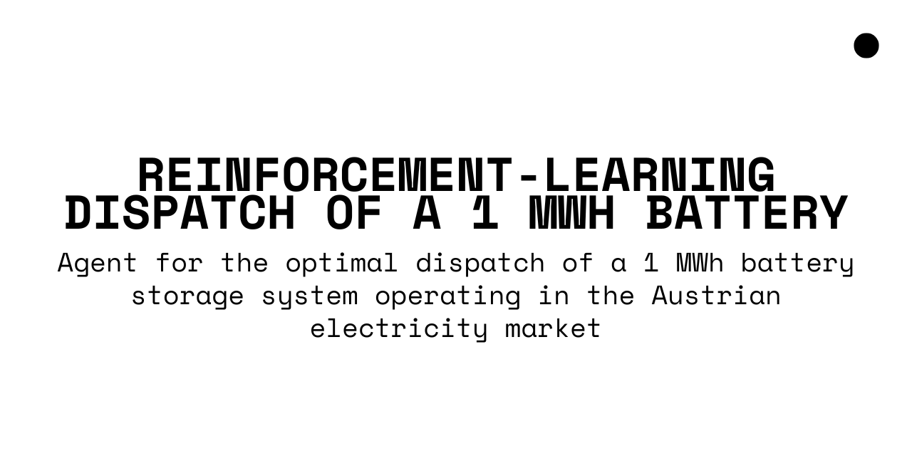

# Reinforcement Learning for Battery Dispatch ⚡🔋

## Project Overview

This project implements a Reinforcement Learning (RL) agent to optimize the dispatch of a 1 MWh battery in electricity markets.
The agent learns when to charge, discharge, or hold the battery based on historical price signals, with the goal of maximizing arbitrage profits under realistic operational constraints.

## Authors
- Udval Oyunsaikhan  
- Andres Cadena
- Sebastian Panesso

## Objectives

- Model a realistic battery environment (capacity, efficiency, state-of-charge).
- Train an RL agent (Deep Q-Network) to learn profitable dispatch strategies.
- Compare RL performance against baseline heuristics.
- Evaluate profit improvements, training dynamics, and operational feasibility.

## Project Structure

- `config.R`
➤ Hyperparameters and experiment setup

- `data_loader.R`
➤ Data loading and preprocessing

- `agent_logic.R`
➤ RL agent functions (Q-learning, replay buffer, training)

- `battery_settings.R`
➤ Battery environment (states, actions, rewards)

- `main_training.R`
➤ Main training loop (integration of all modules)

- `evaluation.R`
➤ Testing and evaluation on unseen price data

- `results/`
➤ Plots, training curves, evaluation metrics

- `README.md`
➤ Project documentation

## Instructions to Run

To fully replicate the environment and results, follow the steps stated in `main.R`.

## Requierements 

- R version 4.x or higher
- R packages: keras, tensorflow, tidyverse
- Basic understanding of:
  - Reinforcement Learning concepts (Q-learning, Deep Q-Networks)
  - RNNs / neural networks and backpropagation through time (for sequence modeling)
